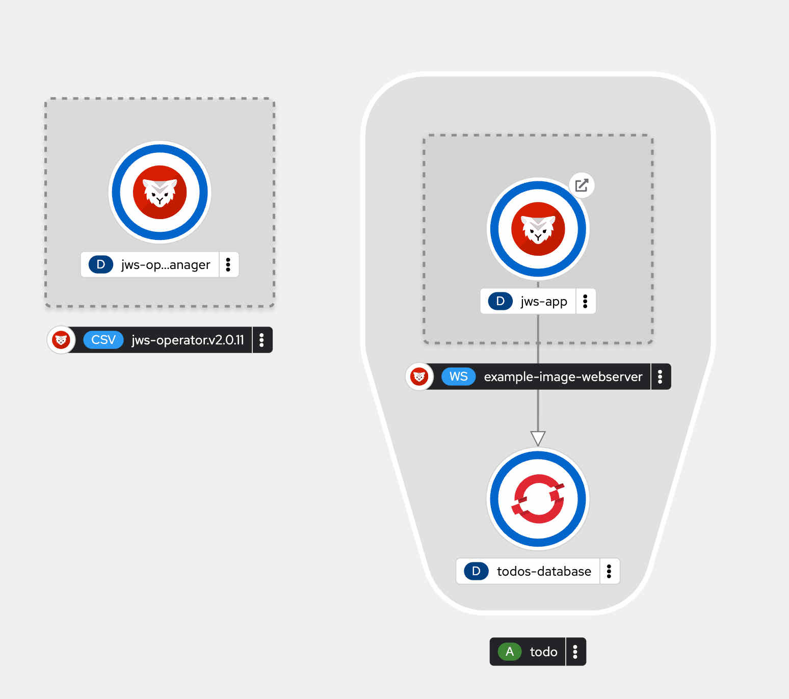
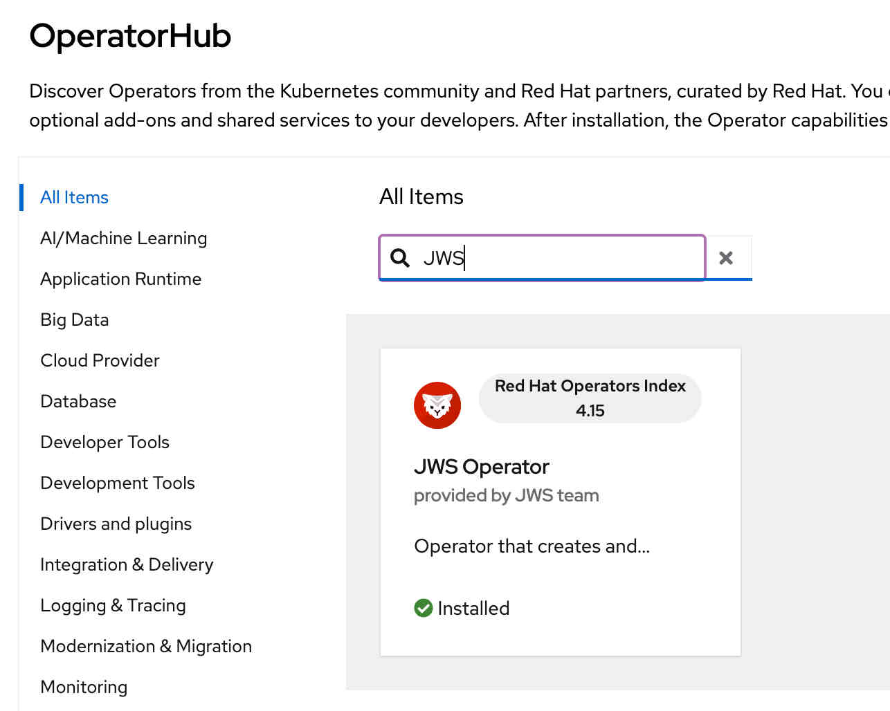
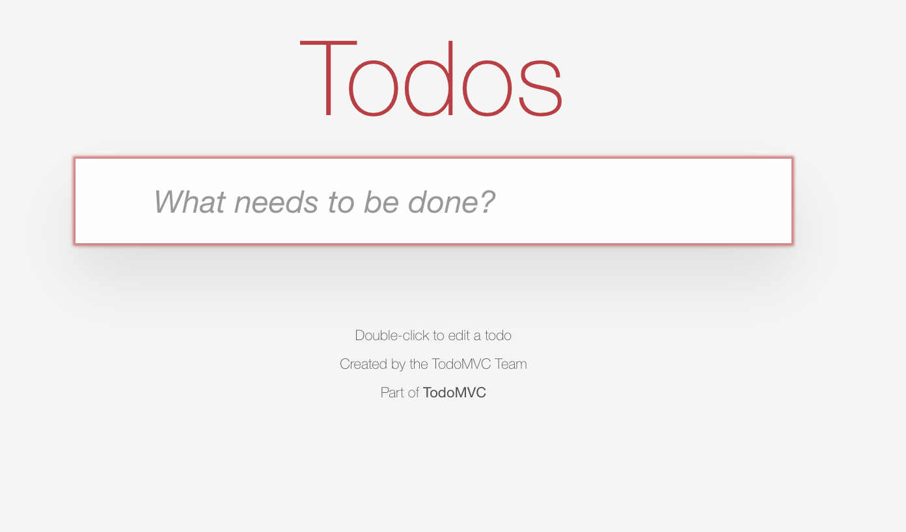

# TODO Demo App - Spring / Angular



## Front End
[TodoMVC](http://todomvc.com/) is a project that provides the same "Todo" application implemented using various popular JavaScript frameworks. The goal of TodoMVC is to help developers compare and contrast the different frameworks and libraries by showing how they each solve the same problem with the same functionality. In this demo app we use [Todo MVC frontend Angular example](https://github.com/tastejs/todomvc/tree/master/examples/angular). The project was built and then copied into the Java project/resources directory to keep in the same application and in the root context. 

## Backend
[Spring Boot](https://spring.io/projects/spring-boot) is a framework designed to simplify the development of stand-alone, production-grade Spring-based applications. It builds on the Spring Framework by providing pre-configured templates and a convention-over-configuration approach, making it easier to set up and deploy applications with minimal configuration.
This project uses Spring Boot framework and the Spring Boot Tomcat Starter. Which is a dependency that you can include in your Spring Boot project to run your application with an embedded Apache Tomcat server. This allows you to package your application as a self-contained executable JAR file that includes Tomcat, making it easy to deploy and run your application without needing to configure an external web server.

## Run the app locally

### 

Run the backend database or you can uncommned the H2 database settings in application.properties. (make sure to comment out the PG props in that case)
Running the PG database for the backend
```bash
podman run --name todos-database -p 5432:5432 -e POSTGRES_USER=jws -e POSTGRES_PASSWORD=jws -e POSTGRES_DB=todos -d postgres:15-alpine 
```

Running the app from source.
The command mvn spring-boot:run is used to run a Spring Boot application using Apache Maven.
the mvn spring-boot:run command is a convenient way to start a Spring Boot application directly from the command line without having to package it first into a JAR or WAR file. It is commonly used during the development phase to quickly test and iterate on the application

```maven
mvn spring-boot:run
```

Its also possible to run the container image locally. The image expects a locally running postgresql with a hostname `todos-database`.
```bash
podman run -p 8080:8080 quay.io/${USER}/todo-demo-jws:latest 
```

### Building the image and pushing it to a repo
First we need to build and package the source files

```maven
mvn clean compile package
```
The command is composed of three separate phases of the Maven build lifecycle: clean, compile, and package. As the goals state once the command completes it should copy the WAR file into the target directory. Ready to be deployed into JBoss Web Server (JWS)

The JWS Operator can use a pre-built image or it can derive one from source code. In this example we create an image and push it to quay.io

First a little about the Dockerfile
```dockerfile
FROM registry.redhat.io/jboss-webserver-6/jws60-openjdk17-openshift-rhel8:6.0.2-2

COPY target/todo-demo-jws-0.0.1-SNAPSHOT.war /deployments/ROOT.war
```
- We use the JBoss Web Server 6 image. The images uses OpenJDK version 17
- We also copy our war file to the root. so it resolves on `/`

Run the following command to build the image. 
```bash
podman build --arch=x86_64 -t quay.io/${USER}/todo-demo-jws:latest .
```
**podman build:** This is the primary command to build a container image using Podman. It is similar to docker build in Docker.

**--arch=x86_64:** This specifies the architecture for the container image. x86_64 indicates that the image should be built for the 64-bit x86 architecture. This is useful when you are building images for different architectures and need to specify the target architecture explicitly. This is useful e.g. if you are running the build on Apple Silicon like the M series.

**-t quay.io/${USER}/todo-demo-jws:latest:** e.g. `-t` for the tag and rest is the repo name/image

Once built push the image to a repository accessible by the OpenShift cluster. [Quay.io](https://quay.io) or the DockerHub are both accessible by an OpenShift cluster as they are publicly hosted and your images are public. 

## Running the app on OpenShift using Operator
First things first we need to deploy a database before we deploy the application
### Database
The following command creates a new PostgreSQL database application in OpenShift using the latest PostgreSQL image. It sets up the database with the username jws, the password jws, and the database name todos. The application is named todos-database.
```bash
oc new-app -e POSTGRESQL_USER=jws \                                                                                                                                                             (base) 
            -e POSTGRESQL_PASSWORD=jws \
            -e POSTGRESQL_DATABASE=todos \
            openshift/postgresql:latest \
            --name=todos-database
```

- **oc new-app:** This is the primary command used to create a new application in OpenShift. It helps to instantiate new applications from source code, templates, or Docker images.
- **-e POSTGRESQL_USER=jws:** This flag sets an environment variable POSTGRESQL_USER with the value jws. In this context, it's used to specify the username for the PostgreSQL database.
- **-e POSTGRESQL_PASSWORD=jws:** Similar to the previous flag, this sets another environment variable POSTGRESQL_PASSWORD with the value jws. This is the password for the PostgreSQL user.
- **-e POSTGRESQL_DATABASE=todos:** This sets the environment variable POSTGRESQL_DATABASE with the value todos, which specifies the name of the PostgreSQL database to be created.
- **openshift/postgresql:latest:** This part specifies the Docker image to use for the new application. openshift/postgresql:latest indicates that the latest version of the PostgreSQL image from OpenShift's repository should be used.
- **--name=todos-database:** This option assigns a name to the new application being created. In this case, the application will be named todos-database.

### The Operator
There are multiple ways to install the operator. The Operator is searchable and installable in the OpenShift Console via the `OperatorHub`



## Creating a new Webserver instance
Once the Operator is installed. The app can be installed with the following CR. 

```yaml
apiVersion: web.servers.org/v1alpha1
kind: WebServer
metadata:
  name: todo-demo-app
  namespace: test
spec:
  webImage:
    applicationImage: 'quay.io/sshaaf/todo-demo-jws'
  applicationName: jws-app
  replicas: 2
```
**apiVersion: web.servers.org/v1alpha1**: This specifies the API version of the resource. In this case, it's `web.servers.org/v1alpha1`, indicating that this resource is part of a custom API group `web.servers.org` and is at version `v1alpha1`.

**kind: WebServer**: This defines the kind of resource being described. Here, it is a `WebServer`. This is a custom resource that is likely defined by a CRD in the Kubernetes cluster.

**metadata**: This section contains metadata about the resource.
- **name: todo-demo-app**: This sets the name of the resource to `todo-demo-app`.
- **namespace: test**This specifies that the resource will be created in the `test` namespace.

**spec:**: This section defines the desired state of the resource.
- **webImage:**: This nested section likely pertains to the image settings for the web server.
- **applicationImage: 'quay.io/sshaaf/todo-demo-jws'**: This specifies the Docker image to use for the application. It points to `quay.io/sshaaf/todo-demo-jws`, which is a hosted image repository (Quay.io).
- **applicationName: jws-app**: This sets the name of the application to `jws-app`.
- **replicas: 2**: This specifies the desired number of replicas (instances) of the application to run. In this case, 2 replicas are requested.

Run the following command to get the route of the deployed application
````bash
oc get routes                                                                                                                                                                                   (base) 

NAME      HOST/PORT                            PATH   SERVICES   PORT    TERMINATION   WILDCARD
jws-app   jws-app-xx.apps.red.demoshift.com          jws-app    <all>                 None

````
You can now use your awesome TODO app running on JWS using Spring boot 3 and AngularJS.


More configuration to play with
- **replicas:**: This specifies the desired number of replicas (instances) of the application to run.
- **useSessionClustering: true**: Enables DNSping session clustering
- **deploying via Webhooks**: [JWS docs](https://access.redhat.com/documentation/en-us/red_hat_jboss_web_server/6.0/html/red_hat_jboss_web_server_operator/create_webhook_secret)

